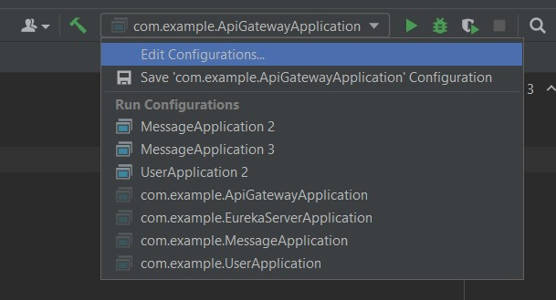
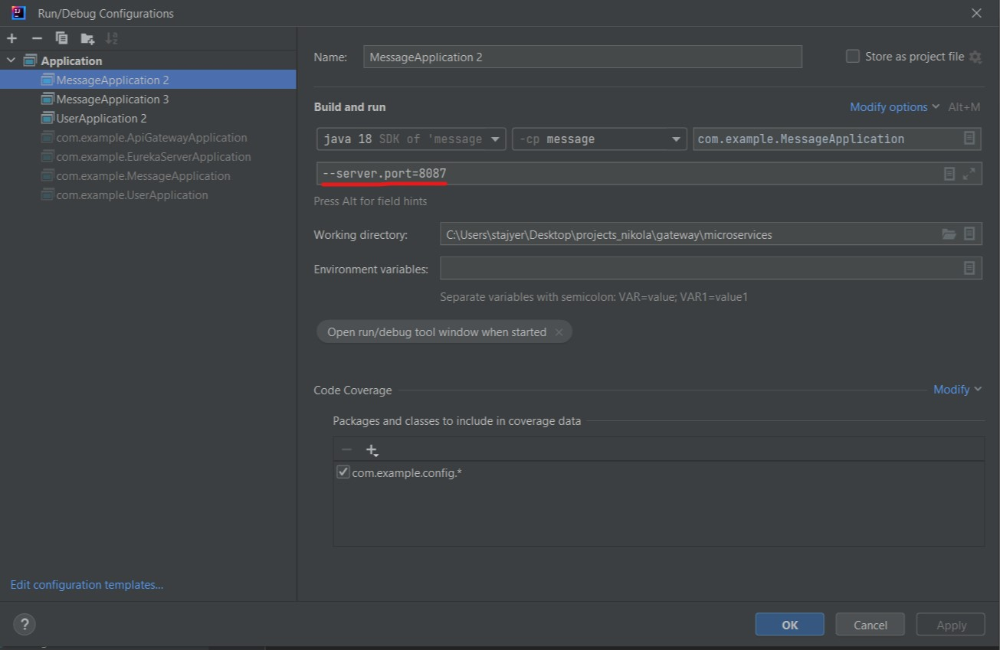

# *Microservices* Project

## Preface

This repository was built to research the microservice architecture, used in backend web development as an alternative to building monolithic server applications that usually don't scale as favorably with an increase in features and incoming traffic.

Monolithic architectures are plagued by the scaling problem, as the project scales and adopts new features it becomes less maintainable, meaning it requires more development time. The onboarding process for newcomers is also very long.

With the microservice approach, the applications' functionality is split into services with regards to the business domain, allowing small teams to work on features concurrently, thus reducing complexity and development time.

One problem with this approach is that while the services themselves are much more simple, the system as a whole increases in complexity significantly. For scalability, services are usually containerized and have multiple instances deployed at the same time. A problem appears when these services need to be coordinated and exposed to the outside world (clients, consumers, internal users).

This project aims to showcase a few key design patterns in a microservice architecture:
- API Gateway
- Load Balancing
- Service Discovery
  
## Modules

The project consists of a couple of Java(***maven-based***) modules:
- `apigw`: Spring Boot Java app implementing Spring Cloud Gateway
- `eureka-server`: Spring Boot java app implementing Netflix open source Eureka library for service discovery
- `message`: Simple service build with spring boot.
- `user`: Simple service built with Spring Boot.

Business domain oriented services are built with Spring Boot. These are standard server applications and they can be written using any other language/framework that provides such functionality. 

On the other hand, `apigw` and `eureka-server` are modules built with first class support from Spring Boot. While an API Gateway and Service Discovery patterns can be built using other languages, they would require and adapter and/or library to provide such functionality.

Other available options are Kubernetes and a Managed API Gateway. Both approaches alleviate manual setup for load balancing algorithms, health checking and service discovery. Kubernetes does require a bit more setup, and is open source and free to use. 

## Run the project

Given the service discovery pattern, the run order of the applications is important. Check the provided README files under each submodule for more details.

Recommended approach would be to open the project root in IntelliJ. This would allow quick deployment, and fix any issues in Java SDK 
incompatibility. Alternatively, `maven` can be used to build and run the `.jar` files from the terminal. 

Another approach would be to use Docker, but this would require more setup in code and appropriate `.dockerfile`s for the 
modules. For reference `.dockerfile`s, check the other repositories' ex. [ktor-rmq](https://github.com/nikolaDrljaca/ktor-rmq/blob/main/Dockerfile)

The project assumes a JDK is present on the system and has higher precedence in the system PATH.

The project level Java SDK required is at least 17.

Run order:
1. `eureka-server`
2. `apigw`
   
After those two services are running, any new services that utilize the eureka client will be detected and added to the pool.

The submodules can be containerized individually and deployed on docker, or a `docker-compose` file can be used to arrange the deployment of all submodules. 

If the project is opened in IntelliJ, the submodules can be run individually. 
In order to test a scenario where multiple instances of the same service are deployed on different ports, the `Edit Configurations` button can be used to open a menu where a running instance can be copied and deployed using different arguments. 

Alternatively, instead of assigning a static port, the port can be set as 0 in the `application.yml` file at which point Spring Boot will assign the port randomly.
The drawback of this approach is that eureka hub will report the services as running on port 0 even though they are not.

## Notes

- Once the application modules are started, a summary (Eureka dashboard) can be accessed at `localhost:8761`
- Health and more information on Gateway connected servers can be viewed at `http://localhost:8083/actuator/health`
- Detailed information on the routes that the Gateway is handling can be viewed at `http://localhost:8083/actuator/gateway/routes`
- More detailed information on a specific route `http://localhost:8083/actuator/gateway/routes/{route_id}`

*This assumes that no changes to ports have been made in the respective `application.yml` files.*

----
