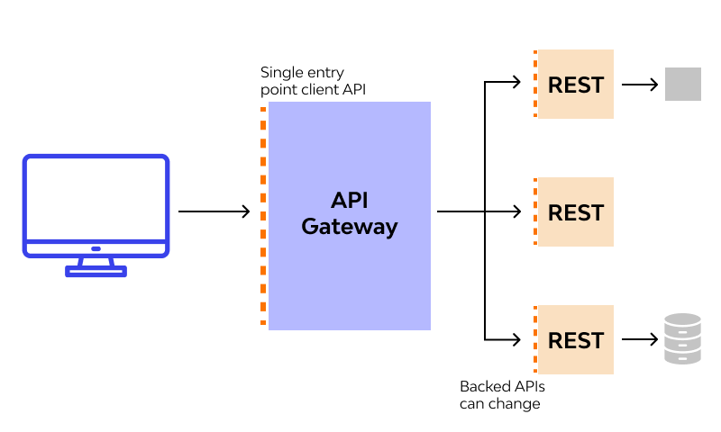

# Microservices - Architecture [Spring Boot]

Details for Service Discovery, API Gateway and Load Balancing

## 1. Service Discovery

- Very important in distributed systems, microservice architecture
- Our services can be running many instances, and their addresses might be assigned dynamically
- Due to internal management, running instances might change address during deployment
- Service discovery allows us to define a Server and Client
- **Server** knows the locations of all clients at all times. Requests are usually routed here.
- **Clients** inform the server of their new address


-----


## 2. API Gateway

Commonly, in a distributed system depending on the number of services and the number of running instances, communicating with services directly might not be the best approach.

For clients, most of the time it is most convenient to expose singular endpoints that 'just work'.

**API Gateway** is a pattern that exposes a single entrypoint for each client. Gateways are most commonly deployed by client device type (mobile, web, vehicle, IoT, etc).

## 3. Load Balancing

Refers to the distribution of incoming traffic to a group of services - *a server pool*.

Requests must be handled in quick and efficient manner, and as demand grows serves usually scale by adding more computers.

A load balancer is responsible for keeping track of healthy services and most efficient routing/distribution of jobs among them.

Two types:

- `external`: Usually coupled with `API Gateway`. Incoming traffic is distributed among available services.
- `internal`: A load balancer placed in from of the MS itself, unknown to the gateway or outside world.

Distribution based on algorithm.

----


----

# Implementation

For an implementation of the above concepts, a few possible options exist.

1. Managed API Gateways
2. Kubernetes
3. Custom solution

## Custom solution

For this proof of concept, Spring Boot was used to build out the services.

Each of the services is built using Spring Boot and has a specific responsibility.

### Eureka Server

Based on the open-source Netflix library.

Very simple to set up with spring boot. 

Dashboard available at `localhost:8761` by default.

Important piece:

```yaml
spring:
  application:
    name: eureka-server

server:
  port: 8761

# NOTE: The server must not register itself, or fetch a list of clients
eureka:
  client:
    fetch-registry: false
    register-with-eureka: false
```

### API Gateway

Spring Cloud is a group of libraries that provide functionality for (non)distributed systems.

Among them is Spring Cloud Gateway.

A few key responsibilities:

- Routing/Forwarding
- Load Balancing
- Health checking

In terms of implementation, Spring does most out of the box.

We are only concerned with the configuration, present in `application.yml`

If the gateway needs additional functionality, such as authentication, it can be 'attached' using `filters` and other Spring libraries.

For our config, a few key points:

```yaml
spring:
  application:
    name: api-gateway # Eureka name
  cloud:
    gateway:
      routes:
        # Provide routes to other services here
        - id: user # ID for the route
          uri: lb://USER # eureka (application) name
          predicates: 
            - Path=/api/v1/user/** # endpoint
        ...
```

The `API Gateway` is considered an `eureka client`. In this regard, we also need the config for `eureka`.

```yaml
eureka:
  client:
    service-url:
      defaultZone: http://localhost:8761/eureka
    fetch-registry: true
    register-with-eureka: true
```

# References

- [https://microservices.io/patterns/microservices.html](https://microservices.io/patterns/microservices.html)
- [https://microservices.io/patterns/data/database-per-service.html](https://microservices.io/patterns/data/database-per-service.html)
- [https://microservices.io/patterns/data/api-composition.html](https://microservices.io/patterns/data/api-composition.html)
- [https://microservices.io/patterns/data/cqrs.html](https://microservices.io/patterns/data/cqrs.html)
- [https://microservices.io/patterns/communication-style/messaging.html](https://microservices.io/patterns/communication-style/messaging.html)
- [https://microservices.io/patterns/apigateway.html](https://microservices.io/patterns/apigateway.html)
- [https://microservices.io/patterns/service-registry.html](https://microservices.io/patterns/service-registry.html)
- [https://www.nginx.com/blog/introduction-to-microservices/](https://www.nginx.com/blog/introduction-to-microservices/)
- [https://docs.microsoft.com/en-us/azure/architecture/microservices](https://docs.microsoft.com/en-us/azure/architecture/microservices/)
- [https://docs.microsoft.com/en-us/azure/architecture/microservices/design](https://docs.microsoft.com/en-us/azure/architecture/microservices/design/)
- [https://docs.microsoft.com/en-us/azure/architecture/microservices/design/patterns](https://docs.microsoft.com/en-us/azure/architecture/microservices/design/patterns)